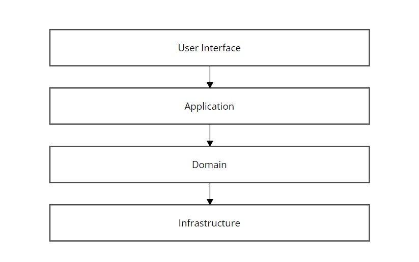
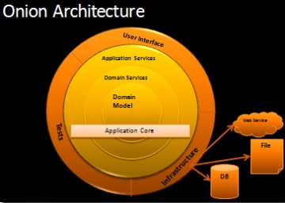

本記事ではソフトウェアアーキテクチャの一種であるオニオンアーキテクチャとその実装について説明します。

オニオンアーキテクチャとはSOLID原則のDependency Inversion Principle(依存性逆転の原則)の適用と、ドメインを中心に据えた階層化を実現するアーキテクチャです。

これを説明するためにまずは元となる旧来のレイヤードアーキテクチャを確認しましょう。

## レイヤードアーキテクチャ



上の図は伝統的なレイヤードアーキテクチャの図です。主に下記の4つのレイヤーでアプリケーションのコードが階層化されています。

- User Interface
    - クライアントからの入出力を担当
- Application
    - プログラムによるビジネスロジックの加工を担当
- Domain
    - ビジネスロジックを担当
- Infrastructure
    - データの永続化や詳細な使用技術(フレームワークなど)を担当


このアーキテクチャの利点は関心事の分離です。各レイヤーはアプリケーションが行う責任と役割で分割されており、上のレイヤーから下のレイヤーに依存しています。各レイヤーで責任が分割されているため、User Interface層ではクライアントからの入力をApplication層に渡してからどう処理されるかを知る必要はないですし、Application層ではビジネスロジックに使用するデータがどこから来て、加工した結果がどう表示されるかを知る必要はないですし、Domain層ではビジネスデータがどのように加工されるかを知る必要はないですし、Infrastructure層ではビジネスデータの永続化を行う理由を知る必要はありません。
このレイヤー設計によって開発者は手を入れる必要のある領域だけに集中することができます。

ただ、上の図を見て分かるようにアプリケーションのコアであるDomain層やApplication層、クライアントの入出力のUser Interface層が詳細な使用技術であるInfrastructure層に依存しています。したがって、DBやフレームワークが変更されるたびにInfrastructure層以外の全ての層に修正が必要になる可能性があります。修正範囲が膨大になると使用技術を変更することが後回しになるため、システムは次第に負債になり、いずれは相応のコストを払って全体を書き換えることになります。

オニオンアーキテクチャはこの問題を解決します。

## オニオンアーキテクチャ


The Onion Architecture : part 1: https://jeffreypalermo.com/2008/07/the-onion-architecture-part-1/

上の図はオニオンアーキテクチャの図です。主に下記の4つのレイヤーでアプリケーションのコードが階層化されています。

- User Interface / Infrastructure / Tests
    - ユーザーからの入出力やデータの永続化、テストを担当
- Application Services
    - プログラムによるビジネスロジックの加工を担当
- Domain Services
    - ビジネスロジックを永続化するためのインターフェースを担当
- Domain Model
    - ビジネスロジックを担当


このアーキテクチャの大きな利点は、Infrastructure層の変更が容易な点です。図ではこれらの四層を円で表現しており、依存関係の向きはUser Interface / Infrastructure / Tests → Application Services → Domain Services → Domain Modelの順になっています。Application Services層がデータを永続化する際は、Domain Services層が提供するインターフェースを介し、Infrastructure層に実装された永続化の具体的な処理にアクセスします。

この際、外部から適切にDI（Dependency Injection）を行うことで、アプリケーションのコア部分はInfrastructure層と疎結合を保つことができ、データベースやフレームワークの置き換えが容易になります。つまり、アプリケーションのコアが外部技術に依存しない設計をすることで、柔軟に使用する技術を変更することが可能になるわけです。

オニオンアーキテクチャの概要がわかったところで、簡単な実装例を見ていきましょう。

## オニオンアーキテクチャの実装例
ここでは例としてリクエストボディでテストID、教科、点数、受験者IDを与えて、受験者のテスト結果を保存し、毎週全受験者の点数から四分位数を計算して、評価を下すアプリケーションをScala, Play frameworkで実装します。

リポジトリ全体は[こちら](https://github.com/uonoko1/exam-manager)からご覧ください。

まず、受験者のテスト結果を保存するためのレイヤーを見ていきます。

User Interface層
```

package controllers

//import文

@Singleton
class ExamResultController @Inject() (
    cc: ControllerComponents,
    examResultUsecase: ExamResultUsecase,
    examResultFieldParser: ExamResultFieldParser,
    examResultIdRequestDtoFactory: ExamResultIdRequestDtoFactory
)(implicit ec: ExecutionContext)
    extends AbstractController(cc) {

  def saveExamResult: Action[JsValue] = Action.async(parse.json) {
    implicit request =>
      examResultFieldParser.parse(request.body) match {
        case Right(
              (
                examId: ExamIdRequestDto,
                subject: SubjectRequestDto,
                score: ScoreRequestDto,
                studentId: StudentIdRequestDto
              )
            ) =>
          examResultUsecase
            .saveExamResult(examId, subject, score, studentId)
            .map {
              case Right(savedExamResult) =>
                Ok(
                  Json.toJson(ExamResultResponseDto.fromDomain(savedExamResult))
                )
              case Left(error) =>
                BadRequest(s"Failed to save exam result: $error")
            }
            .recover { case ex =>
              InternalServerError(
                s"Failed to save exam result: ${ex.getMessage}"
              )
            }
        case Right(_) =>
          Future.successful(BadRequest("Invalid parameters"))
        case Left(errors) =>
          Future.successful(BadRequest(s"Invalid parameters: $errors"))
      }
  }
}
```

Application Services層
```

package usecases.examResult

//import文

@Singleton
class ExamResultUsecase @Inject() (
    examResultRepository: ExamResultRepository,
    ulidGenerator: UlidGenerator,
    systemClock: SystemClock
)(implicit ec: ExecutionContext) {

  def saveExamResult(
      examIdRequestDto: ExamIdRequestDto,
      subjectRequestDto: SubjectRequestDto,
      scoreRequestDto: ScoreRequestDto,
      studentIdRequestDto: StudentIdRequestDto
  ): Future[Either[String, ExamResult]] =
    (for {
      (examId, subject, score, studentId) <- EitherT.fromEither[Future](
        ExamResultToDomainConverter.convert[(ExamId, Subject, Score, StudentId)](
          Some(examIdRequestDto),
          Some(subjectRequestDto),
          Some(scoreRequestDto),
          Some(studentIdRequestDto)
        )
      )

      examResultIdStr <- EitherT.rightT[Future, String](
        ulidGenerator.generate()
      )

      examResultId <- EitherT.fromEither[Future](
        ExamResultId.create(examResultIdStr)
      )

      examResult = ExamResult(
        examResultId,
        examId,
        score,
        studentId,
        Evaluation.NotEvaluated,
        CreatedAt(systemClock.now()),
        UpdatedAt(systemClock.now())
      )
      savedExamResult <- EitherT(examResultRepository.save(examResult))
    } yield savedExamResult).value
}
```

```

package utils

trait UlidGenerator {
  def generate(): String
}

```

```

package utils

//import文

trait SystemClock {
  def now(): ZonedDateTime
}

class SystemClockImpl extends SystemClock {
  override def now(): ZonedDateTime = ZonedDateTime.now()
}
```

Domain Services層
```

package usecases.examResult.repository

//import文

trait ExamResultRepository {
  def save(examResult: ExamResult): Future[Either[String, ExamResult]]
}

```

Domain Model層(以下Domain層)
```

package domain.examResult.entity

//import文

case class ExamResult(
    examResultId: ExamResultId,
    examId: ExamId,
    score: Score,
    studentId: StudentId,
    evaluation: Evaluation = Evaluation.NotEvaluated,
    createdAt: CreatedAt,
    updatedAt: UpdatedAt
)
```

Infrastructure層
```

package infrastructure.db.repositories

//import文

@Singleton
class ExamResultRepositoryImplOnDb @Inject() (
    dbConfig: DatabaseConfig,
    scheduler: Scheduler
)(implicit
    ec: ExecutionContext
) extends ExamResultRepository {
  import dbConfig._
  import profile.api._

  override def save(
      examResult: ExamResult
  ): Future[Either[String, ExamResult]] = {
    val dto = ExamResultDto.fromDomain(examResult)
    val query = ExamResultTable.examResults += dto
    Retry
      .withRetry(run(query), 3, 1.second)(ec, scheduler)
      .map(_ => Right(examResult))
      .recover {
        case ex: SQLTransientConnectionException =>
          Left(s"Database connection error: ${ex.getMessage}")
        case ex: Throwable => Left(ex.getMessage)
      }
  }
}

```

```

package infrastructure.libs

//import文

@Singleton
class UlidGeneratorImpl @Inject() extends UlidGenerator {
  override def generate(): String = ULID.newULID.toString
}

```

上記コードは下記の通り、各クラス/インターフェースがオニオンアーキテクチャの各層に対応しています。

- ExamResultController → User Interface層
- ExamResultUsecase, UlidGenerator, SystemClock, SystemClockImpl → Application Service層
- ExamResultRepository → Domain Service層
- ExamResult → Domain層
- ExamResultRepositoryImplOnDb, UlidGeneratorImpl → Infrastructure層


それではまずUser Interface層から処理の流れを見ていきましょう。

User Interface層
```

package controllers

//import文

@Singleton
class ExamResultController @Inject() (
    cc: ControllerComponents,
    examResultUsecase: ExamResultUsecase,
    examResultFieldParser: ExamResultFieldParser,
    examResultIdRequestDtoFactory: ExamResultIdRequestDtoFactory
)(implicit ec: ExecutionContext)
    extends AbstractController(cc) {

  def saveExamResult: Action[JsValue] = Action.async(parse.json) {
    implicit request =>
      examResultFieldParser.parse(request.body) match {
        case Right(
              (
                examId: ExamIdRequestDto,
                subject: SubjectRequestDto,
                score: ScoreRequestDto,
                studentId: StudentIdRequestDto
              )
            ) =>
          examResultUsecase
            .saveExamResult(examId, subject, score, studentId)
            .map {
              case Right(savedExamResult) =>
                Ok(
                  Json.toJson(ExamResultResponseDto.fromDomain(savedExamResult))
                )
              case Left(error) =>
                BadRequest(s"Failed to save exam result: $error")
            }
            .recover { case ex =>
              InternalServerError(
                s"Failed to save exam result: ${ex.getMessage}"
              )
            }
        case Right(_) =>
          Future.successful(BadRequest("Invalid parameters"))
        case Left(errors) =>
          Future.successful(BadRequest(s"Invalid parameters: $errors"))
      }
  }
}
```

User Interface層の責務はクライアントからの入力とクライアントへの出力です。APIエンドポイントを叩くことでこのExamResultController.saveExamResultメソッドが実行されます。メソッドが実行されるとまずはリクエストデータをパースしてDTOのインスタンス化をする処理に入ります。User Interface層はクライアントからの入力データをアプリケーションコアが操作できる形式に変換してから、アプリケーションコアに引き渡し、アプリケーションコアから返ってきたデータをクライアントに表示する形式に変換してレスポンスすることが求められますので、この層での作業はアプリケーションコアとの間の変換とアプリケーションコアへの命令の2つです。ExamResultController.saveExamResultメソッドではexamResultFieldParser.parserメソッドがクライアントからの入力データの変換を担っています。リクエストデータがexamId(テストID),subject(教科),score(点数),studentId(受験者ID)に変換できていれば、Application Services層のメソッドを実行し、変換に失敗していればBad Requestをレスポンスします。

それでは入力データの変換が成功したときに実行されるApplication Services層を見ていきましょう。

Application Services層
```

package usecases.examResult

//import文

@Singleton
class ExamResultUsecase @Inject() (
    examResultRepository: ExamResultRepository,
    ulidGenerator: UlidGenerator,
    systemClock: SystemClock
)(implicit ec: ExecutionContext) {

  def saveExamResult(
      examIdRequestDto: ExamIdRequestDto,
      subjectRequestDto: SubjectRequestDto,
      scoreRequestDto: ScoreRequestDto,
      studentIdRequestDto: StudentIdRequestDto
  ): Future[Either[String, ExamResult]] =
    (for {
      (examId, subject, score, studentId) <- EitherT.fromEither[Future](
        ExamResultToDomainConverter.convert[(ExamId, Subject, Score, StudentId)](
          Some(examIdRequestDto),
          Some(subjectRequestDto),
          Some(scoreRequestDto),
          Some(studentIdRequestDto)
        )
      )

      examResultIdStr <- EitherT.rightT[Future, String](
        ulidGenerator.generate()
      )

      examResultId <- EitherT.fromEither[Future](
        ExamResultId.create(examResultIdStr)
      )

      examResult = ExamResult(
        examResultId,
        examId,
        score,
        studentId,
        Evaluation.NotEvaluated,
        CreatedAt(systemClock.now()),
        UpdatedAt(systemClock.now())
      )
      savedExamResult <- EitherT(examResultRepository.save(examResult))
    } yield savedExamResult).value
}

```

```

package utils

trait UlidGenerator {
  def generate(): String
}

```

```

package utils

//import文

trait SystemClock {
  def now(): ZonedDateTime
}

class SystemClockImpl extends SystemClock {
  override def now(): ZonedDateTime = ZonedDateTime.now()
}
```

Application Services層の責務はビジネスロジックをプログラムで実現する際のユースケースを表現することです。ここで表現するべきユースケースは受験者からのテスト結果を保存することです。これをプログラムで実現する際のイメージが下記です。

- テスト結果のユニークIDを生成する。
- 生成したユニークIDとUser Interface層から受け取ったデータを元にテスト結果のオブジェクトを生成する。
- 生成したテスト結果のオブジェクトを保存する。
- 保存したオブジェクトをUser Interface層に返す。


ここではユニークIDに外部ライブラリを用いて生成したULIDを使用しています。従来のレイヤードアーキテクチャではApplication Services層から直接Infrastructure層のULID生成ロジックにアクセスしていましたが、これではアプリケーションのコアがライブラリに依存してしまうため今後のライブラリ置き換えコストが大きくなってしまいます。オニオンアーキテクチャの提案はInfrastructure層に直接アクセスするのではなく、アプリケーションコアに抽象としてのインターフェースを定義してアプリケーションコアからはそのインターフェースを参照し、Infrastructure層ではアプリケーションコアで定義したインターフェースを継承して詳細技術にアクセスする(具象化)というものです。Application Services層とInfrastructure層はともにインターフェースに依存することで依存性が逆転します。DIコンテナなどを用いて外部から依存性を注入することでApplication Services層がInfrastructure層と疎結合に保ちながら詳細技術にアクセス可能になります。

次に生成したユニークIDとUser Interface層から受け取ったデータを元に下記Domain層のExamResultクラスのインスタンスを生成します。

Domain層
```

package domain.examResult.entity

//import文

case class ExamResult(
    examResultId: ExamResultId,
    examId: ExamId,
    score: Score,
    studentId: StudentId,
    evaluation: Evaluation = Evaluation.NotEvaluated,
    createdAt: CreatedAt,
    updatedAt: UpdatedAt
)
```

ちなみにExamResultのインスタンスを生成する際にCreatedAt,UpdatedAtに渡したsystemClock.nowはテスタビリティを担保するために副作用である時刻をインターフェースを介して扱うSystemClockパターンを使用しています。これによってテストコードでは任意の時刻を与えることが容易になり、テスタビリティの向上が見込めます。
```

package utils

//import文

trait SystemClock {
  def now(): ZonedDateTime
}

class SystemClockImpl extends SystemClock {
  override def now(): ZonedDateTime = ZonedDateTime.now()
}
```

その後、テスト結果のインスタンスを保存する必要があります。ここでもApplication Services層から直接Infrastructure層の永続化メソッドにアクセスするのではなく、Application Services層からはDomain Services層で定義したインターフェースを参照するようにします。Infrastructure層でDomain Services層で定義したインターフェースを実装することで依存性を逆転させ、詳細技術との疎結合を保ちます。

Domain Services層
```

package usecases.examResult.repository

//import文

trait ExamResultRepository {
  def save(examResult: ExamResult): Future[Either[String, ExamResult]]
}
```

上記レポジトリで保存した結果をUser Interface層に返すことでApplication Services層の責務は終了です。ただ、実際にはUlidGeneratorやExamResultRepositoryはあくまでインターフェースなのでこれを下記のようにInfrastructure層で実装する必要があります。

Infrastructure層
```

package infrastructure.libs

//import文

@Singleton
class UlidGeneratorImpl @Inject() extends UlidGenerator {
  override def generate(): String = ULID.newULID.toString
}

```

```

package infrastructure.db.repositories

//import文

@Singleton
class ExamResultRepositoryImplOnDb @Inject() (
    dbConfig: DatabaseConfig,
    scheduler: Scheduler
)(implicit
    ec: ExecutionContext
) extends ExamResultRepository {
  import dbConfig._
  import profile.api._

  override def save(
      examResult: ExamResult
  ): Future[Either[String, ExamResult]] = {
    val dto = ExamResultDto.fromDomain(examResult)
    val query = ExamResultTable.examResults += dto
    Retry
      .withRetry(run(query), 3, 1.second)(ec, scheduler)
      .map(_ => Right(examResult))
      .recover {
        case ex: SQLTransientConnectionException =>
          Left(s"Database connection error: ${ex.getMessage}")
        case ex: Throwable => Left(ex.getMessage)
      }
  }
}

```

Infrastructure層の責務は詳細技術を使用した問題の解決です。UlidGeneratorを実装したUlidGeneratorImplではULIDを生成するライブラリのAPI呼び出しを返しています。ExamResultRepositoryを実装したExamResultRepositoryImplOnDbではメソッドパラメータで受け取ったテスト結果のインスタンスをデータベースのテーブルに対応したDTO(Data Transfer Object)のインスタンスに変換してから、テスト結果のテーブルにレコードとして追加するクエリを作成して実行します。ここではデータベースのセッションエラー対策として自動リトライロジックを持つRetry関数内でクエリを実行しています。クエリ実行が成功すれば保存したテスト結果のインスタンスをメソッドの呼び出し元であるApplication Services層に返します。

Application Services層のExamResultUsecase.saveExamResultメソッドではExamResultRepository.saveメソッドの返り値をそのままUser Interface層のExamResultController.saveExamResultメソッドに返します。

User Interface層
```

package controllers

//import文

@Singleton
class ExamResultController @Inject() (
    cc: ControllerComponents,
    examResultUsecase: ExamResultUsecase,
    examResultFieldParser: ExamResultFieldParser,
    examResultIdRequestDtoFactory: ExamResultIdRequestDtoFactory
)(implicit ec: ExecutionContext)
    extends AbstractController(cc) {

  def saveExamResult: Action[JsValue] = Action.async(parse.json) {
    implicit request =>
      examResultFieldParser.parse(request.body) match {
        case Right(
              (
                examId: ExamIdRequestDto,
                subject: SubjectRequestDto,
                score: ScoreRequestDto,
                studentId: StudentIdRequestDto
              )
            ) =>
          examResultUsecase
            .saveExamResult(examId, subject, score, studentId)
            .map {
              case Right(savedExamResult) =>
                Ok(
                  Json.toJson(ExamResultResponseDto.fromDomain(savedExamResult))
                )
              case Left(error) =>
                BadRequest(s"Failed to save exam result: $error")
            }
            .recover { case ex =>
              InternalServerError(
                s"Failed to save exam result: ${ex.getMessage}"
              )
            }
        case Right(_) =>
          Future.successful(BadRequest("Invalid parameters"))
        case Left(errors) =>
          Future.successful(BadRequest(s"Invalid parameters: $errors"))
      }
  }
}
```

User Interface層のExamResultController.saveExamResultメソッドではApplication Services層のExamResultUsecase.saveExamResultメソッドが成功すれば、ドメインオブジェクトのインスタンスをクライアントが期待する形式に変換してからJsonでレスポンスします。

これでテスト結果の保存が完了しました。次に保存された複数のテスト結果を毎週四分位数を用いた評価を下すロジックを考えましょう。

まずは各レイヤーを見ていきます。

User Interface層
```

package scheduler

//import文

@Singleton
class JobScheduler @Inject() (
    actorSystem: ActorSystem,
    examResultUsecase: ExamResultUsecase,
    systemClock: SystemClock,
    isTestMode: Boolean = false
)(implicit ec: ExecutionContext) {

  def calculateInitialDelay(): FiniteDuration = {
    if (isTestMode) {
      Duration.Zero
    } else {
      val now = systemClock.now()
      val nextSunday = now
        .`with`(
          java.time.temporal.TemporalAdjusters
            .nextOrSame(java.time.DayOfWeek.SUNDAY)
        )
        .plusDays(1)
        .withHour(0)
        .withMinute(0)
        .withSecond(0)
        .withNano(0)
      val duration = java.time.Duration.between(now, nextSunday)
      FiniteDuration(duration.toMillis, MILLISECONDS)
    }
  }

  val period: FiniteDuration =
    if (isTestMode) 1.second else FiniteDuration(7, DAYS)

  private val scheduleRunnable: () => Unit = () => {
    examResultUsecase.evaluateResults().map {
      case Right(_)    => println("Scheduled job completed successfully.")
      case Left(error) => println(s"Scheduled job failed with error: $error")
    }
  }

  if (isTestMode) {
    actorSystem.scheduler.scheduleOnce(calculateInitialDelay()) {
      scheduleRunnable()
    }
  } else {
    actorSystem.scheduler.scheduleWithFixedDelay(
      calculateInitialDelay(),
      period
    ) {
      new Runnable {
        def run(): Unit = scheduleRunnable()
      }
    }
  }
}

```

Application Services層
```

package usecases.examResult

//import文

@Singleton
class ExamResultUsecase @Inject() (
    examResultRepository: ExamResultRepository,
    examRepository: ExamRepository,
    evaluator: Evaluator,
    evaluationPeriodProvider: EvaluationPeriodProvider,
    examResultUpdater: ExamResultUpdater,
    examUpdater: ExamUpdater,
    ulidGenerator: UlidGenerator,
    systemClock: SystemClock
)(implicit ec: ExecutionContext) {

  def evaluateResults(): Future[Either[String, Unit]] =
    (for {
      (startDate, endDate) <- EitherT.pure[Future, String](
        evaluationPeriodProvider.getEvaluationPeriod(systemClock.now())
      )
      exams <- EitherT(examRepository.findByDueDate(startDate, endDate))
      examEvaluations <- exams.traverse { exam =>
        for {
          results <- EitherT(examResultRepository.findByExamId(exam.examId))
          evaluations = evaluator.evaluate(exam, results)
        } yield (exam, results, evaluations)
      }
      _ <- examEvaluations.traverse_ { case (exam, results, evaluations) =>
        for {
          updatedResults <- EitherT(
            examResultUpdater.updateEvaluations(
              results,
              evaluations,
              systemClock.now()
            )
          )
          _ <- EitherT(
            examUpdater.updateEvaluations(exam, updatedResults, results)
          )
        } yield ()
      }
    } yield ()).value
}

```

```

package usecases.examResult.logic.examResultUpdater.`trait`

//import文

trait ExamResultUpdater {
  def updateEvaluations(
      results: Seq[ExamResult],
      evaluations: Map[ExamResult, Evaluation],
      now: ZonedDateTime
  ): Future[Either[String, Seq[ExamResult]]]
}
```

```

package usecases.examResult.logic.examResultUpdater.impl

//import文

class ExamResultUpdaterImpl @Inject() (
    examResultRepository: ExamResultRepository
)(implicit ec: ExecutionContext)
    extends ExamResultUpdater {

  override def updateEvaluations(
      results: Seq[ExamResult],
      evaluations: Map[ExamResult, Evaluation],
      now: ZonedDateTime
  ): Future[Either[String, Seq[ExamResult]]] = {
    val updatedResults = results.map { result =>
      evaluations.get(result) match {
        case Some(evaluation) =>
          result.copy(
            evaluation = evaluation,
            updatedAt = UpdatedAt(now)
          )
        case None => throw new Exception("Evaluation not found for result")
      }
    }
    Future
      .sequence(updatedResults.map(examResultRepository.update))
      .map { resultSeq =>
        val errors = resultSeq.collect { case Left(error) => error }
        if (errors.nonEmpty) Left(errors.mkString(", "))
        else Right(updatedResults)
      }
      .recover { case ex => Left(ex.getMessage) }
  }
}
```

```

package usecases.exam.logic.examUpdater.`trait`

//import文

trait ExamUpdater {
  def updateEvaluations(
      exam: Exam,
      updatedExamResults: Seq[ExamResult],
      examResults: Seq[ExamResult]
  ): Future[Either[String, Exam]]
}
```

```

package usecases.exam.logic.examUpdater.impl

//import文

class ExamUpdaterImpl @Inject() (
    examRepository: ExamRepository,
    systemClock: SystemClock
)(implicit
    ec: ExecutionContext
) extends ExamUpdater {

  override def updateEvaluations(
      exam: Exam,
      updatedExamResults: Seq[ExamResult],
      examResults: Seq[ExamResult]
  ): Future[Either[String, Exam]] = {
    val newStatus = if (updatedExamResults.size == examResults.size) {
      EvaluationStatus.Evaluated
    } else if (updatedExamResults.nonEmpty) {
      EvaluationStatus.PartiallyEvaluated
    } else {
      EvaluationStatus.NotEvaluated
    }

    val updatedExam = exam.copy(
      evaluationStatus = newStatus,
      updatedAt = UpdatedAt(systemClock.now())
    )
    examRepository.update(updatedExam)
  }
}
```

```

package utils

//import文

trait SystemClock {
  def now(): ZonedDateTime
}

class SystemClockImpl extends SystemClock {
  override def now(): ZonedDateTime = ZonedDateTime.now()
}
```

Domain Services層
```

package usecases.examResult.repository

//import文

trait ExamResultRepository {
  def findByExamId(examId: ExamId): Future[Either[String, Seq[ExamResult]]]
}

```

```

package usecases.exam.repository

//import文

trait ExamRepository {
  def findByDueDate(
      startDate: ZonedDateTime,
      endDate: ZonedDateTime
  ): Future[Either[String, Seq[Exam]]]
}
```

Domain層
```

package domain.evaluationPeriodProvider.`trait`

//import文

trait EvaluationPeriodProvider {
  def getEvaluationPeriod(now: ZonedDateTime): (ZonedDateTime, ZonedDateTime)
}
```

```

package domain.evaluationPeriodProvider.impl

//import文

class WeeklyEvaluationPeriodProviderImpl extends EvaluationPeriodProvider {
  override def getEvaluationPeriod(
      now: ZonedDateTime
  ): (ZonedDateTime, ZonedDateTime) = {
    val startOfWeek = now
      .minusWeeks(1)
      .toLocalDate
      .`with`(TemporalAdjusters.previousOrSame(DayOfWeek.MONDAY))
      .atStartOfDay(now.getZone)
    val endOfWeek = now
      .minusWeeks(1)
      .toLocalDate
      .`with`(TemporalAdjusters.nextOrSame(DayOfWeek.SUNDAY))
      .atTime(23, 59, 59, 999999999)
      .atZone(now.getZone)
    (startOfWeek, endOfWeek)
  }
}
```

```

package domain.evaluator.`trait`

//import文

trait Evaluator {
  def evaluate(
      exam: Exam,
      results: Seq[ExamResult]
  ): Map[ExamResult, Evaluation]
}
```

```

package domain.evaluator.impl

//import文

class QuartileEvaluatorImpl extends Evaluator {

  def evaluate(
      exam: Exam,
      results: Seq[ExamResult]
  ): Map[ExamResult, Evaluation] = {
    if (results.isEmpty) {
      return Map.empty
    }

    val sortedResults = results.sortBy(_.score.value)
    val q1Index = sortedResults.length / 4
    val q2Index = sortedResults.length / 2
    val q3Index = sortedResults.length * 3 / 4

    val q1Score = sortedResults(q1Index).score.value
    val q2Score = sortedResults(q2Index).score.value
    val q3Score = sortedResults(q3Index).score.value

    results.map { result =>
      val evaluation = result.score.value match {
        case _ if result.score.value >= q3Score => Evaluation.Excellent
        case _ if result.score.value >= q2Score => Evaluation.GoodJob
        case _ if result.score.value >= q1Score => Evaluation.Passed
        case _                                  => Evaluation.Failed
      }
      result -> evaluation
    }.toMap
  }
}
```

```

package domain.exam.entity

//import文

case class Exam(
    examId: ExamId,
    subject: Subject,
    dueDate: DueDate,
    evaluationStatus: EvaluationStatus,
    createdAt: CreatedAt,
    updatedAt: UpdatedAt
)
```

```

package domain.examResult.entity

//import文

case class ExamResult(
    examResultId: ExamResultId,
    examId: ExamId,
    score: Score,
    studentId: StudentId,
    evaluation: Evaluation = Evaluation.NotEvaluated,
    createdAt: CreatedAt,
    updatedAt: UpdatedAt
)
```

Infrastructure層
```

package infrastructure.db.repositories

//import文

@Singleton
class ExamRepositoryImplOnDb @Inject() (
    dbConfig: DatabaseConfig,
    scheduler: Scheduler
)(implicit
    ec: ExecutionContext
) extends ExamRepository {
  import dbConfig._
  import profile.api._

  override def findByDueDate(
      startDate: ZonedDateTime,
      endDate: ZonedDateTime
  ): Future[Either[String, Seq[Exam]]] = {
    val query = ExamTable.exams
      .filter(exam => exam.dueDate >= startDate && exam.dueDate <= endDate)
      .result

    Retry
      .withRetry(run(query), 3, 1.second)(ec, scheduler)
      .map { dtos =>
        val exams = dtos.map(ExamDto.toDomain)
        val (errors, validExams) = exams.partitionMap(identity)

        if (errors.nonEmpty) {
          Left(errors.mkString(", "))
        } else if (validExams.isEmpty) {
          Left("No exams found for the given period")
        } else {
          Right(validExams)
        }
      }
      .recover {
        case ex: SQLTransientConnectionException =>
          Left(s"Database connection error: ${ex.getMessage}")
        case ex: Throwable => Left(ex.getMessage)
      }
  }

  override def update(exam: Exam): Future[Either[String, Exam]] = {
    val dto = ExamDto.fromDomain(exam)
    val query =
      ExamTable.exams.filter(_.examId === dto.examIdDto.value).update(dto)
    Retry
      .withRetry(run(query), 3, 1.second)(ec, scheduler)
      .map(_ => Right(exam))
      .recover {
        case ex: SQLTransientConnectionException =>
          Left(s"Database connection error: ${ex.getMessage}")
        case ex: Throwable => Left(ex.getMessage)
      }
  }
}
```

```

package infrastructure.db.repositories

//import文

@Singleton
class ExamResultRepositoryImplOnDb @Inject() (
    dbConfig: DatabaseConfig,
    scheduler: Scheduler
)(implicit
    ec: ExecutionContext
) extends ExamResultRepository {
  import dbConfig._
  import profile.api._

  override def findByExamId(
      examId: ExamId
  ): Future[Either[String, Seq[ExamResult]]] = {
    val query = ExamResultTable.examResults
      .filter(_.examId === examId.value)
      .result
    Retry
      .withRetry(run(query), 3, 1.second)(ec, scheduler)
      .map { dtos =>
        val examResults = dtos.map(ExamResultDto.toDomain)
        val errors = examResults.collect { case Left(error) => error }
        if (errors.nonEmpty) {
          Left(errors.mkString(", "))
        } else {
          Right(examResults.collect { case Right(examResult) => examResult })
        }
      }
      .recover {
        case ex: SQLTransientConnectionException =>
          Left(s"Database connection error: ${ex.getMessage}")
        case ex: Throwable => Left(ex.getMessage)
      }
  }

  override def update(
      examResult: ExamResult
  ): Future[Either[String, ExamResult]] = {
    val dto = ExamResultDto.fromDomain(examResult)
    val query = ExamResultTable.examResults
      .filter(_.examResultId === dto.examResultId)
      .update(dto)
    Retry
      .withRetry(run(query), 3, 1.second)(ec, scheduler)
      .map(_ => Right(examResult))
      .recover {
        case ex: SQLTransientConnectionException =>
          Left(s"Database connection error: ${ex.getMessage}")
        case ex: Throwable => Left(ex.getMessage)
      }
  }
}
```

上記コードは下記の通り、各クラス/インターフェースがオニオンアーキテクチャの各層に対応しています。

- JobScheduler → User Interface層
- ExamResultUsecase,ExamResultUpdater,ExamResultUpdaterImpl,ExamUpdater,ExamUpdaterImpl,SystemClock → Application Services層
- ExamRepository,ExamResultRepository → Domain Services層
- EvaluationPeriodProvider,WeeklyEvaluationPeriodProviderImpl,Evaluator,QuartileEvaluatorImpl,Exam,ExamResult → Domain層
- ExamRepositoryImplOnDb,ExamResultRepositoryImplOnDb → Infrastructure層


それではまずUser Interface層から処理の流れを見ていきましょう。

User Interface層
```

package scheduler

//import文

@Singleton
class JobScheduler @Inject() (
    actorSystem: ActorSystem,
    examResultUsecase: ExamResultUsecase,
    systemClock: SystemClock,
    isTestMode: Boolean = false
)(implicit ec: ExecutionContext) {

  def calculateInitialDelay(): FiniteDuration = {
    if (isTestMode) {
      Duration.Zero
    } else {
      val now = systemClock.now()
      val nextSunday = now
        .`with`(
          java.time.temporal.TemporalAdjusters
            .nextOrSame(java.time.DayOfWeek.SUNDAY)
        )
        .plusDays(1)
        .withHour(0)
        .withMinute(0)
        .withSecond(0)
        .withNano(0)
      val duration = java.time.Duration.between(now, nextSunday)
      FiniteDuration(duration.toMillis, MILLISECONDS)
    }
  }

  val period: FiniteDuration =
    if (isTestMode) 1.second else FiniteDuration(7, DAYS)

  private val scheduleRunnable: () => Unit = () => {
    examResultUsecase.evaluateResults().map {
      case Right(_)    => println("Scheduled job completed successfully.")
      case Left(error) => println(s"Scheduled job failed with error: $error")
    }
  }

  if (isTestMode) {
    actorSystem.scheduler.scheduleOnce(calculateInitialDelay()) {
      scheduleRunnable()
    }
  } else {
    actorSystem.scheduler.scheduleWithFixedDelay(
      calculateInitialDelay(),
      period
    ) {
      new Runnable {
        def run(): Unit = scheduleRunnable()
      }
    }
  }
}

```

上記はApache Pekkoが提供するActorSystemのスケジューリング機能を使用して毎週日曜日の24時0分0秒(毎週月曜日の0時0分0秒)にApplication Services層のexamResultUsecase.evaluateResultsメソッドを実行するクラスです。コンストラクタパラメータにisTestModeを用意することでテスト時のハンドリングができるようにしています。

それでは毎週末に実行されるApplication Services層を見ていきましょう。

Application Services層
```

package usecases.examResult

//import文

@Singleton
class ExamResultUsecase @Inject() (
    examResultRepository: ExamResultRepository,
    examRepository: ExamRepository,
    evaluator: Evaluator,
    evaluationPeriodProvider: EvaluationPeriodProvider,
    examResultUpdater: ExamResultUpdater,
    examUpdater: ExamUpdater,
    ulidGenerator: UlidGenerator,
    systemClock: SystemClock
)(implicit ec: ExecutionContext) {

  def evaluateResults(): Future[Either[String, Unit]] =
    (for {
      (startDate, endDate) <- EitherT.pure[Future, String](
        evaluationPeriodProvider.getEvaluationPeriod(systemClock.now())
      )
      exams <- EitherT(examRepository.findByDueDate(startDate, endDate))
      examEvaluations <- exams.traverse { exam =>
        for {
          results <- EitherT(examResultRepository.findByExamId(exam.examId))
          evaluations = evaluator.evaluate(exam, results)
        } yield (exam, results, evaluations)
      }
      _ <- examEvaluations.traverse_ { case (exam, results, evaluations) =>
        for {
          updatedResults <- EitherT(
            examResultUpdater.updateEvaluations(
              results,
              evaluations,
              systemClock.now()
            )
          )
          _ <- EitherT(
            examUpdater.updateEvaluations(exam, updatedResults, results)
          )
        } yield ()
      }
    } yield ()).value
}

```

```

package usecases.examResult.logic.examResultUpdater.`trait`

//import文

trait ExamResultUpdater {
  def updateEvaluations(
      results: Seq[ExamResult],
      evaluations: Map[ExamResult, Evaluation],
      now: ZonedDateTime
  ): Future[Either[String, Seq[ExamResult]]]
}
```

```

package usecases.examResult.logic.examResultUpdater.impl

//import文

class ExamResultUpdaterImpl @Inject() (
    examResultRepository: ExamResultRepository
)(implicit ec: ExecutionContext)
    extends ExamResultUpdater {

  override def updateEvaluations(
      results: Seq[ExamResult],
      evaluations: Map[ExamResult, Evaluation],
      now: ZonedDateTime
  ): Future[Either[String, Seq[ExamResult]]] = {
    val updatedResults = results.map { result =>
      evaluations.get(result) match {
        case Some(evaluation) =>
          result.copy(
            evaluation = evaluation,
            updatedAt = UpdatedAt(now)
          )
        case None => throw new Exception("Evaluation not found for result")
      }
    }
    Future
      .sequence(updatedResults.map(examResultRepository.update))
      .map { resultSeq =>
        val errors = resultSeq.collect { case Left(error) => error }
        if (errors.nonEmpty) Left(errors.mkString(", "))
        else Right(updatedResults)
      }
      .recover { case ex => Left(ex.getMessage) }
  }
}
```

```

package usecases.exam.logic.examUpdater.`trait`

//import文

trait ExamUpdater {
  def updateEvaluations(
      exam: Exam,
      updatedExamResults: Seq[ExamResult],
      examResults: Seq[ExamResult]
  ): Future[Either[String, Exam]]
}
```

```

package usecases.exam.logic.examUpdater.impl

//import文

class ExamUpdaterImpl @Inject() (
    examRepository: ExamRepository,
    systemClock: SystemClock
)(implicit
    ec: ExecutionContext
) extends ExamUpdater {

  override def updateEvaluations(
      exam: Exam,
      updatedExamResults: Seq[ExamResult],
      examResults: Seq[ExamResult]
  ): Future[Either[String, Exam]] = {
    val newStatus = if (updatedExamResults.size == examResults.size) {
      EvaluationStatus.Evaluated
    } else if (updatedExamResults.nonEmpty) {
      EvaluationStatus.PartiallyEvaluated
    } else {
      EvaluationStatus.NotEvaluated
    }

    val updatedExam = exam.copy(
      evaluationStatus = newStatus,
      updatedAt = UpdatedAt(systemClock.now())
    )
    examRepository.update(updatedExam)
  }
}
```

```

package utils

//import文

trait SystemClock {
  def now(): ZonedDateTime
}

class SystemClockImpl extends SystemClock {
  override def now(): ZonedDateTime = ZonedDateTime.now()
}
```

ExamResultUsecase.evaluateResultsメソッドは毎週末にUser Interface層から実行されます。ここで表現するべきユースケースは毎週末に提出期限日が過ぎているテストの答案をまとめて四分位数に基づいて評価をすることです。これをプログラムで実現する際のイメージは下記です。

- 現在日時に基づいて先週の月曜日と先週の日曜日の日時を取得する。
- 期限日が先週の月曜日から先週の日曜日までのテストを取得する。
- 取得したテストごとに受験者の答案をまとめて取得する。
- 取得したテストごとの答案を四分位数をもとに評価する。
- 下した評価を基に各答案の評価を更新する。
- 答案の評価更新が完了次第、テストの評価ステータスを更新する。


ExamResultUsecaseクラスではあくまで上記のユースケースを表現するだけにとどめて、実際のロジックはインターフェースを介して外部に記述することにします。こうすることでユースケースの視認性やロジックのテスタビリティ、変更容易性が向上します。ExamResultUsecase.evaluateResultsメソッドではユースケースの各工程に下記の関数が対応しています。

- 現在日時に基づいて先週の月曜日と先週の日曜日の日時を取得する。
    - evaluationPeriodProvider.getEvaluationPeriod((systemClock.now()))
- 期限日が先週の月曜日から先週の日曜日までのテストを取得する。
    - examRepository.findByDueDate(startDate, endDate)
- 取得したテストごとに受験者の答案をまとめて取得する。
    - examResultRepository.findByExamId(exam.examId)
- 取得したテストごとの答案を四分位数をもとに評価する。
    - evaluator.evaluate(exam, results)
- 下した評価を基に各答案の評価を更新する。
    - examResultUpdater.updateEvaluations(results, evaluations, (systemClock.now()))
- 答案の評価更新が完了次第、テストの評価ステータスを更新する。
    - examUpdater.updateEvaluations(exam, updatedResults, results)


それではExamResultUsecase.evaluateResultsメソッドで呼んでいる各関数を見ていきましょう。

evaluationPeriodProvider.getEvaluationPeriod((systemClock.now())) :Domain層
```

package domain.evaluationPeriodProvider.`trait`

//import文

trait EvaluationPeriodProvider {
  def getEvaluationPeriod(now: ZonedDateTime): (ZonedDateTime, ZonedDateTime)
}
```

実装コード :Domain層
```

package domain.evaluationPeriodProvider.impl

//import文

class WeeklyEvaluationPeriodProviderImpl extends EvaluationPeriodProvider {
  override def getEvaluationPeriod(
      now: ZonedDateTime
  ): (ZonedDateTime, ZonedDateTime) = {
    val startOfWeek = now
      .minusWeeks(1)
      .toLocalDate
      .`with`(TemporalAdjusters.previousOrSame(DayOfWeek.MONDAY))
      .atStartOfDay(now.getZone)
    val endOfWeek = now
      .minusWeeks(1)
      .toLocalDate
      .`with`(TemporalAdjusters.nextOrSame(DayOfWeek.SUNDAY))
      .atTime(23, 59, 59, 999999999)
      .atZone(now.getZone)
    (startOfWeek, endOfWeek)
  }
}
```

評価期間を提供するEvaluationPeriodProviderにWeeklyEvaluationPeriodProviderImplを実装することで、どの期間を評価期間とするかの意味を与えています。

examRepository.findByDueDate(startDate, endDate) :Domain Services層
```

package usecases.exam.repository

//import文

trait ExamRepository {
  def findByDueDate(
      startDate: ZonedDateTime,
      endDate: ZonedDateTime
  ): Future[Either[String, Seq[Exam]]]
}
```

実装コード :Infrastructure層
```

package infrastructure.db.repositories

//import文

@Singleton
class ExamRepositoryImplOnDb @Inject() (
    dbConfig: DatabaseConfig,
    scheduler: Scheduler
)(implicit
    ec: ExecutionContext
) extends ExamRepository {
  import dbConfig._
  import profile.api._

  override def findByDueDate(
      startDate: ZonedDateTime,
      endDate: ZonedDateTime
  ): Future[Either[String, Seq[Exam]]] = {
    val query = ExamTable.exams
      .filter(exam => exam.dueDate >= startDate && exam.dueDate <= endDate)
      .result

    Retry
      .withRetry(run(query), 3, 1.second)(ec, scheduler)
      .map { dtos =>
        val exams = dtos.map(ExamDto.toDomain)
        val (errors, validExams) = exams.partitionMap(identity)

        if (errors.nonEmpty) {
          Left(errors.mkString(", "))
        } else if (validExams.isEmpty) {
          Left("No exams found for the given period")
        } else {
          Right(validExams)
        }
      }
      .recover {
        case ex: SQLTransientConnectionException =>
          Left(s"Database connection error: ${ex.getMessage}")
        case ex: Throwable => Left(ex.getMessage)
      }
  }
}
```

パラメータで受け取ったstartDateからendDateまでにdueDateがあるテストをまとめて取得します。これもDomain Service層で定義したインターフェースをInfrastructure層で実装することで、詳細技術の影響がアプリケーションコアに入らないように管理しています。

examResultRepository.findByExamId(exam.examId) :Domain Services層
```

package usecases.examResult.repository

//import文

trait ExamResultRepository {
  def findByExamId(examId: ExamId): Future[Either[String, Seq[ExamResult]]]
}
```

実装コード :Infrastructure層
```

package infrastructure.db.repositories

//import文

@Singleton
class ExamResultRepositoryImplOnDb @Inject() (
    dbConfig: DatabaseConfig,
    scheduler: Scheduler
)(implicit
    ec: ExecutionContext
) extends ExamResultRepository {
  import dbConfig._
  import profile.api._

  override def findByExamId(
      examId: ExamId
  ): Future[Either[String, Seq[ExamResult]]] = {
    val query = ExamResultTable.examResults
      .filter(_.examId === examId.value)
      .result
    Retry
      .withRetry(run(query), 3, 1.second)(ec, scheduler)
      .map { dtos =>
        val examResults = dtos.map(ExamResultDto.toDomain)
        val errors = examResults.collect { case Left(error) => error }
        if (errors.nonEmpty) {
          Left(errors.mkString(", "))
        } else {
          Right(examResults.collect { case Right(examResult) => examResult })
        }
      }
      .recover {
        case ex: SQLTransientConnectionException =>
          Left(s"Database connection error: ${ex.getMessage}")
        case ex: Throwable => Left(ex.getMessage)
      }
  }
}
```

ここではexamRepository.findByDueDate(startDate, endDate)で取得した各テストのIDを使用して受験者の答案をまとめて取得しています。

evaluator.evaluate(exam, results): Domain層
```

package domain.evaluator.`trait`

//import文

trait Evaluator {
  def evaluate(
      exam: Exam,
      results: Seq[ExamResult]
  ): Map[ExamResult, Evaluation]
}
```

実装コード: Domain層
```

package domain.evaluator.impl

//import文

class QuartileEvaluatorImpl extends Evaluator {

  def evaluate(
      exam: Exam,
      results: Seq[ExamResult]
  ): Map[ExamResult, Evaluation] = {
    if (results.isEmpty) {
      return Map.empty
    }

    val sortedResults = results.sortBy(_.score.value)
    val q1Index = sortedResults.length / 4
    val q2Index = sortedResults.length / 2
    val q3Index = sortedResults.length * 3 / 4

    val q1Score = sortedResults(q1Index).score.value
    val q2Score = sortedResults(q2Index).score.value
    val q3Score = sortedResults(q3Index).score.value

    results.map { result =>
      val evaluation = result.score.value match {
        case _ if result.score.value >= q3Score => Evaluation.Excellent
        case _ if result.score.value >= q2Score => Evaluation.GoodJob
        case _ if result.score.value >= q1Score => Evaluation.Passed
        case _                                  => Evaluation.Failed
      }
      result -> evaluation
    }.toMap
  }
}
```

パラメータでテストと答案を受け取って評価をするメソッドです。答案の評価は下記の4種類です。

- 優秀 → Evaluation.Excellent
- 良 → Evaluation.GoodJob
- 可 → Evaluation.Passed
- 不可 → Evaluation.Failed


ドメインロジックをインターフェースで定義して外部から実装をDIすることで、ビジネスの変化に応じて評価ロジックを容易に切り替えることができるようになります。ここでは例として四分位数に基づいた評価ロジックを使用しています。

Application Services層  
examResultUpdater.updateEvaluations(results, evaluations, (systemClock.now()))
```

package usecases.examResult.logic.examResultUpdater.`trait`

import domain.examResult.entity.ExamResult
import domain.examResult.valueObject.Evaluation
import scala.concurrent.Future
import java.time.ZonedDateTime

trait ExamResultUpdater {
  def updateEvaluations(
      results: Seq[ExamResult],
      evaluations: Map[ExamResult, Evaluation],
      now: ZonedDateTime
  ): Future[Either[String, Seq[ExamResult]]]
}
```

Application Services層  
実装コード
```

package usecases.examResult.logic.examResultUpdater.impl

//import文

class ExamResultUpdaterImpl @Inject() (
    examResultRepository: ExamResultRepository
)(implicit ec: ExecutionContext)
    extends ExamResultUpdater {

  override def updateEvaluations(
      results: Seq[ExamResult],
      evaluations: Map[ExamResult, Evaluation],
      now: ZonedDateTime
  ): Future[Either[String, Seq[ExamResult]]] = {
    val updatedResults = results.map { result =>
      evaluations.get(result) match {
        case Some(evaluation) =>
          result.copy(
            evaluation = evaluation,
            updatedAt = UpdatedAt(now)
          )
        case None => throw new Exception("Evaluation not found for result")
      }
    }
    Future
      .sequence(updatedResults.map(examResultRepository.update))
      .map { resultSeq =>
        val errors = resultSeq.collect { case Left(error) => error }
        if (errors.nonEmpty) Left(errors.mkString(", "))
        else Right(updatedResults)
      }
      .recover { case ex => Left(ex.getMessage) }
  }
}
```

答案、評価、現在時刻をパラメータで受け取って各答案の評価ステータスを更新します。答案の評価ステータスと更新日時を更新したディープコピーをexamResultRepository.updateで永続化します。

Domain Services層  
examResultRepository.update(examResult: ExamResult)
```

package usecases.examResult.repository

//import文

trait ExamResultRepository {
  def update(examResult: ExamResult): Future[Either[String, ExamResult]]
}
```

Infrastructure層  
実装コード
```

package infrastructure.db.repositories

//import文

@Singleton
class ExamResultRepositoryImplOnDb @Inject() (
    dbConfig: DatabaseConfig,
    scheduler: Scheduler
)(implicit
    ec: ExecutionContext
) extends ExamResultRepository {
  import dbConfig._
  import profile.api._

  override def update(
      examResult: ExamResult
  ): Future[Either[String, ExamResult]] = {
    val dto = ExamResultDto.fromDomain(examResult)
    val query = ExamResultTable.examResults
      .filter(_.examResultId === dto.examResultId)
      .update(dto)
    Retry
      .withRetry(run(query), 3, 1.second)(ec, scheduler)
      .map(_ => Right(examResult))
      .recover {
        case ex: SQLTransientConnectionException =>
          Left(s"Database connection error: ${ex.getMessage}")
        case ex: Throwable => Left(ex.getMessage)
      }
  }
}
```

パラメータで受け取った答案のドメインオブジェクトをDTOに詰め替えてから更新処理を行います。

Application Services層  
examUpdater.updateEvaluations(exam, updatedResults, results)
```

package usecases.exam.logic.examUpdater.`trait`

//import文

trait ExamUpdater {
  def updateEvaluations(
      exam: Exam,
      updatedExamResults: Seq[ExamResult],
      examResults: Seq[ExamResult]
  ): Future[Either[String, Exam]]
}
```

Application Services層  
実装コード
```

package usecases.exam.logic.examUpdater.impl

//import文

class ExamUpdaterImpl @Inject() (
    examRepository: ExamRepository,
    systemClock: SystemClock
)(implicit
    ec: ExecutionContext
) extends ExamUpdater {

  override def updateEvaluations(
      exam: Exam,
      updatedExamResults: Seq[ExamResult],
      examResults: Seq[ExamResult]
  ): Future[Either[String, Exam]] = {
    val newStatus = if (updatedExamResults.size == examResults.size) {
      EvaluationStatus.Evaluated
    } else if (updatedExamResults.nonEmpty) {
      EvaluationStatus.PartiallyEvaluated
    } else {
      EvaluationStatus.NotEvaluated
    }

    val updatedExam = exam.copy(
      evaluationStatus = newStatus,
      updatedAt = UpdatedAt(systemClock.now())
    )
    examRepository.update(updatedExam)
  }
}
```

答案の更新が完了したら答案の更新状況をテストの評価ステータスに更新します。テストの評価ステータスは下記の4種類です。

- 全ての評価が完了 → Evaluation.Evaluated
- 評価が部分的に完了 → Evaluation.PartiallyEvaluated
- 未評価 → Evaluation.NotEvaluated


examResultRepository.updateで更新が完了した場合に答案のインスタンスを返すようにしています。更新完了後のインスタンスをupdatedExamResultsで定義してexamUpdater.updateEvaluationsがパラメータに渡しているので、examUpdater.updateEvaluations内ではupdatedExamResults(評価の更新が完了した答案)とexamResults(評価の更新を行うべき答案)の要素数を比べることで、評価ステータスを決定できます。評価ステータスを決定できれば評価ステータスと更新日時だけを更新したディープコピーを作成して永続化を行います。

Domain Services層  
examRepository.update(updatedExam)
```

package usecases.exam.repository

//import文

trait ExamRepository {
  def update(exam: Exam): Future[Either[String, Exam]]
}
```

Infrastructure層  
実装コード
```

package infrastructure.db.repositories

//import文

@Singleton
class ExamRepositoryImplOnDb @Inject() (
    dbConfig: DatabaseConfig,
    scheduler: Scheduler
)(implicit
    ec: ExecutionContext
) extends ExamRepository {
  import dbConfig._
  import profile.api._

  override def update(exam: Exam): Future[Either[String, Exam]] = {
    val dto = ExamDto.fromDomain(exam)
    val query =
      ExamTable.exams.filter(_.examId === dto.examIdDto.value).update(dto)
    Retry
      .withRetry(run(query), 3, 1.second)(ec, scheduler)
      .map(_ => Right(exam))
      .recover {
        case ex: SQLTransientConnectionException =>
          Left(s"Database connection error: ${ex.getMessage}")
        case ex: Throwable => Left(ex.getMessage)
      }
  }
}
```

答案の更新と同じく、パラメータで受け取ったテストのドメインオブジェクトをDTOに詰め替えて更新を行います。

Application Services層
```

package usecases.examResult

//import文

@Singleton
class ExamResultUsecase @Inject() (
    examResultRepository: ExamResultRepository,
    examRepository: ExamRepository,
    evaluator: Evaluator,
    evaluationPeriodProvider: EvaluationPeriodProvider,
    examResultUpdater: ExamResultUpdater,
    examUpdater: ExamUpdater,
    ulidGenerator: UlidGenerator,
    systemClock: SystemClock
)(implicit ec: ExecutionContext) {

  def evaluateResults(): Future[Either[String, Unit]] =
    (for {
      (startDate, endDate) <- EitherT.pure[Future, String](
        evaluationPeriodProvider.getEvaluationPeriod(systemClock.now())
      )
      exams <- EitherT(examRepository.findByDueDate(startDate, endDate))
      examEvaluations <- exams.traverse { exam =>
        for {
          results <- EitherT(examResultRepository.findByExamId(exam.examId))
          evaluations = evaluator.evaluate(exam, results)
        } yield (exam, results, evaluations)
      }
      _ <- examEvaluations.traverse_ { case (exam, results, evaluations) =>
        for {
          updatedResults <- EitherT(
            examResultUpdater.updateEvaluations(
              results,
              evaluations,
              systemClock.now()
            )
          )
          _ <- EitherT(
            examUpdater.updateEvaluations(exam, updatedResults, results)
          )
        } yield ()
      }
    } yield ()).value
}
```

これでApplication Services層の全ての処理が終了したので呼び出し元のUser Interface層にデータを返します。ちなみに今回のコードではモナドトランスフォーマーとしてEitherTを使用しています。EitherTはFuture[Either[A, B]]のような構造をEitherT[Future, A, B]という簡潔な形で管理でき、mapやflatMapメソッドを使ってネストされたEitherモナドに簡単にアクセスできます。これにより、処理の途中でFuture[Left[_]]が返ってきた場合、その時点で処理が中断され、エラーがメソッドの呼び出し元に伝播されます。

User Interface層
```

package scheduler

//import文

@Singleton
class JobScheduler @Inject() (
    actorSystem: ActorSystem,
    examResultUsecase: ExamResultUsecase,
    systemClock: SystemClock,
    isTestMode: Boolean = false
)(implicit ec: ExecutionContext) {

  def calculateInitialDelay(): FiniteDuration = {
    if (isTestMode) {
      Duration.Zero
    } else {
      val now = systemClock.now()
      val nextSunday = now
        .`with`(
          java.time.temporal.TemporalAdjusters
            .nextOrSame(java.time.DayOfWeek.SUNDAY)
        )
        .plusDays(1)
        .withHour(0)
        .withMinute(0)
        .withSecond(0)
        .withNano(0)
      val duration = java.time.Duration.between(now, nextSunday)
      FiniteDuration(duration.toMillis, MILLISECONDS)
    }
  }

  val period: FiniteDuration =
    if (isTestMode) 1.second else FiniteDuration(7, DAYS)

  private val scheduleRunnable: () => Unit = () => {
    examResultUsecase.evaluateResults().map {
      case Right(_)    => println("Scheduled job completed successfully.")
      case Left(error) => println(s"Scheduled job failed with error: $error")
    }
  }

  if (isTestMode) {
    actorSystem.scheduler.scheduleOnce(calculateInitialDelay()) {
      scheduleRunnable()
    }
  } else {
    actorSystem.scheduler.scheduleWithFixedDelay(
      calculateInitialDelay(),
      period
    ) {
      new Runnable {
        def run(): Unit = scheduleRunnable()
      }
    }
  }
}
```

examResultUsecase.evaluateResultsが完了次第、実行結果に基づいてログ出力をして終了です。

## まとめ
これで、テスト結果を保存し、毎週末に評価を行うアプリケーションをオニオンアーキテクチャを用いて実装することができました。オニオンアーキテクチャの最大のメリットは、Domain層がInfrastructure層の詳細に依存しないことです。Domain層はビジネスロジックを表現することに責任を持ち、ビジネスの核心部分を担うため、使用している技術スタックの変更などによる影響を受けるべきではありません。オニオンアーキテクチャは、Domain層を他の層からの変更の影響から守ることで、ビジネスロジックを明確かつ柔軟にコードで表現することを可能にします。

ただし、デメリットとしてはレイヤードアーキテクチャと比べて設計コストが高くなる点が挙げられます。そのため、保守性や拡張性の優先度が相対的に低い場合オニオンアーキテクチャを選択する理由は少なくなるため、レイヤードアーキテクチャの方が適しているケースもあります。例えば、次のようなケースが考えられます：

- 小規模なシステムや開発スピードが求められるプロジェクト
- データ処理が単純で、頻繁に変更が発生しないシステム
- CQRSのWriterとReaderでアプリケーションを分割する際のReader側のシステムなど


## 参考リンク
-  https://jeffreypalermo.com/2008/07/the-onion-architecture-part-1/
- https://jeffreypalermo.com/2008/07/the-onion-architecture-part-2/
- https://jeffreypalermo.com/2008/08/the-onion-architecture-part-3/
- https://jeffreypalermo.com/2013/08/onion-architecture-part-4-after-four-years/
