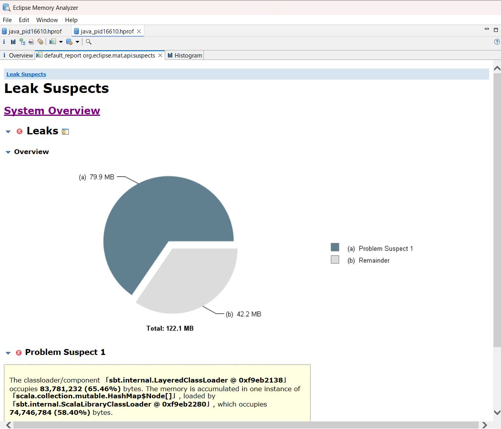
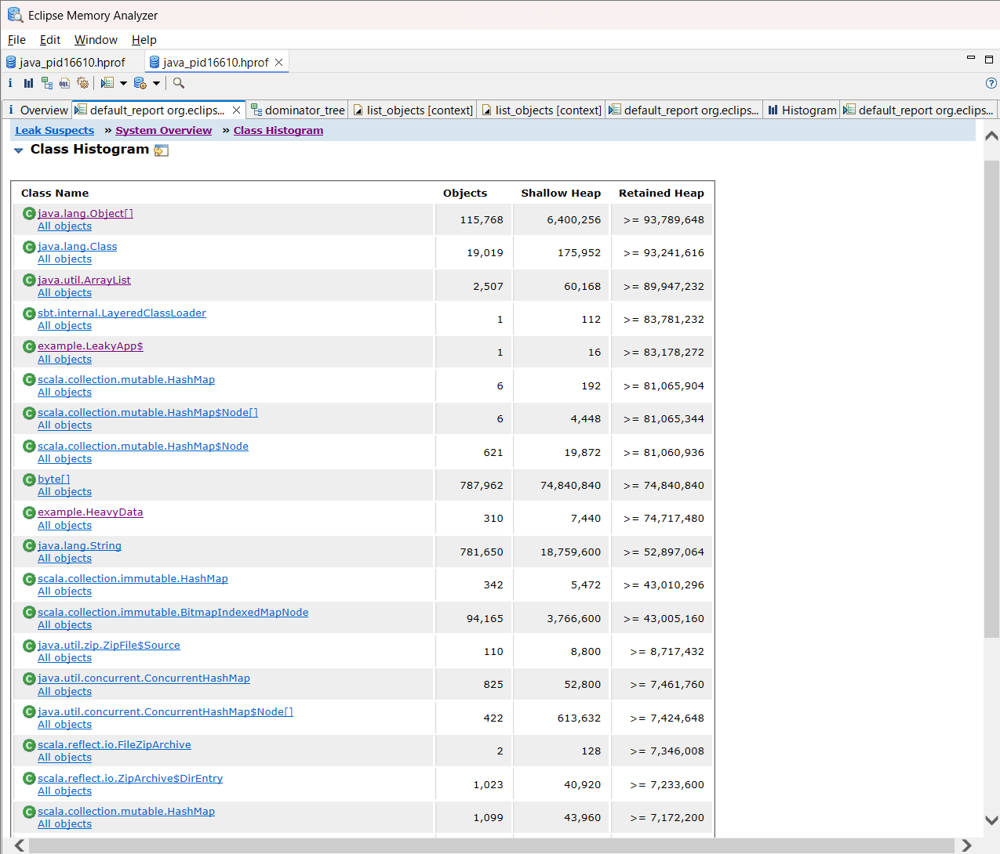
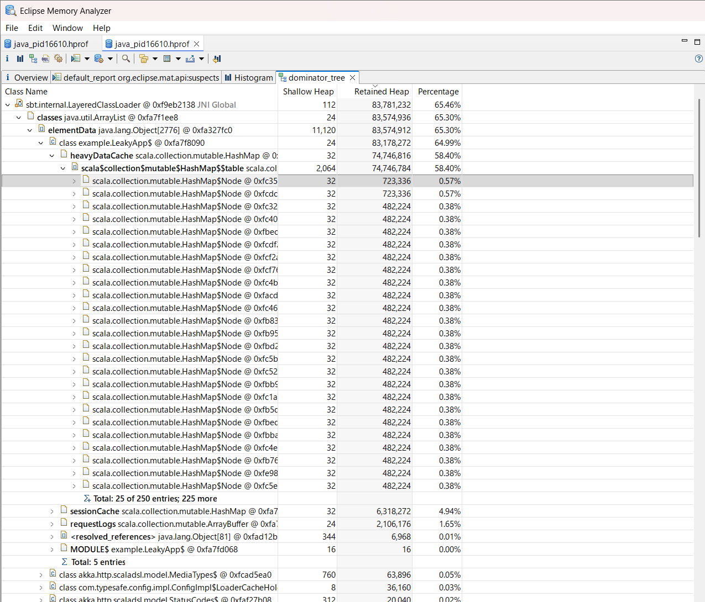
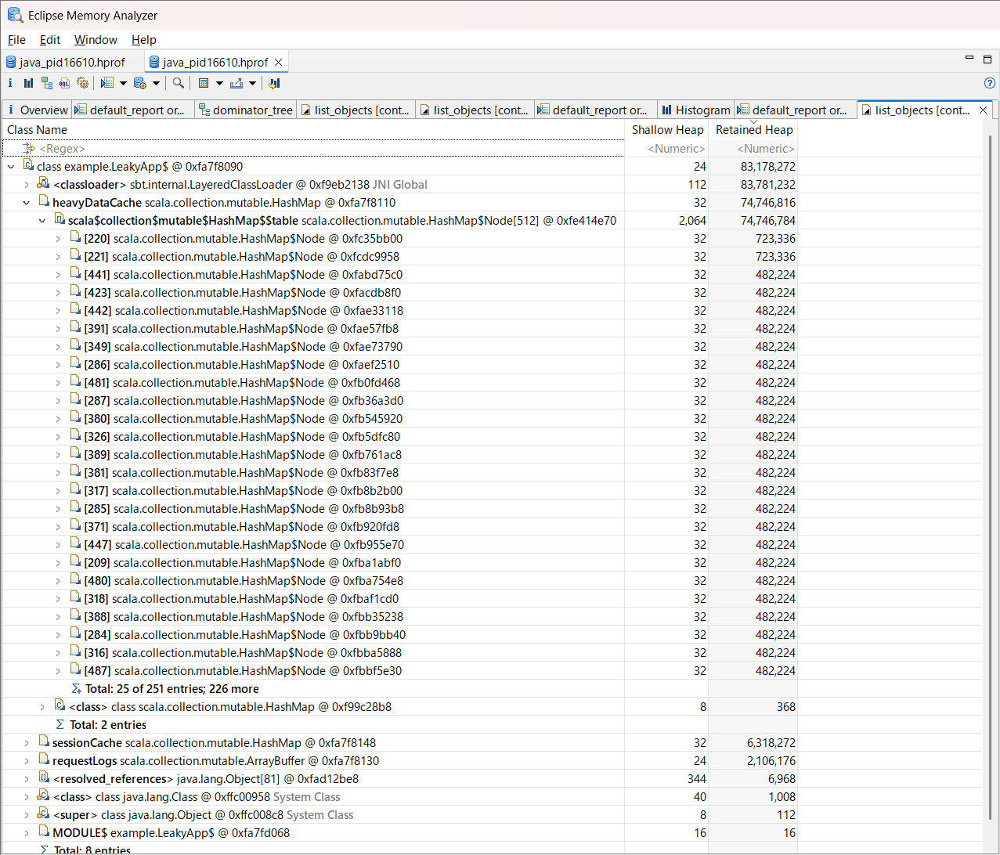

この記事は[ヌーラボブログリレー2025冬 Tech](https://adventar.org/calendars/11965)の9日目として投稿しています。


これまでヒープダンプの解析をしたことがなく、実態もよくつかめていなかったので、ちょうどよいタイミングということで学習ついでにブログに残しておく。

## 1. ヒープダンプとは

ヒープダンプとは、アプリケーションが使用しているメモリ（ヒープ領域）のスナップショットのこと。ある瞬間にメモリ上に存在する全オブジェクトの状態を丸ごとファイルに保存している。

JVMの場合、拡張子は `.hprof` になる。ファイルサイズはヒープサイズとほぼ同じになるので、本番環境で取得する際はディスク容量に注意が必要。

### いつ使う？

主に以下のような場面で活躍する。

- OutOfMemoryError が発生したとき - 何がメモリを食い尽くしたのか特定したい
- メモリ使用量が増え続けるとき - メモリリークの原因を探りたい
- パフォーマンス改善 - 「何がメモリを使っているか」を把握して最適化したい

---

## 2. 今回使用するサンプルアプリケーション

解析の題材として、意図的にメモリリークを起こす Scala アプリケーションを用意した。Akka HTTP で作ったシンプルな Web API として動作する。

```scala
object LeakyApp {

  // リークポイント1: セッションキャッシュ（クリアされない）
  private val sessionCache = mutable.Map[String, UserSession]()

  // リークポイント2: リクエストログ（無限に蓄積）
  private val requestLogs = mutable.ArrayBuffer[RequestLog]()

  // リークポイント3: 重いデータのキャッシュ
  private val heavyDataCache = mutable.Map[String, HeavyData]()

  // ... 以下ルーティング定義
}
```

このアプリには3つのリークポイントがある。

1. sessionCache - ログインのたびにセッションを追加するが、削除処理がない
2. requestLogs - リクエストログを追加し続けるが、ローテーションがない
3. heavyDataCache - 100KB のデータをキャッシュするが、上限がない

`object` で定義しているため、これらの変数はアプリケーションの生存期間中ずっと保持され続ける。典型的なメモリリークのパターンと言える。

エンドポイントは以下の通り。

| エンドポイント | 動作 |
|---------------|------|
| `GET /login/{userId}` | セッション作成（リークする） |
| `GET /api/{endpoint}` | リクエストログ記録（リークする） |
| `GET /data/{key}` | 重いデータ取得（リークする） |
| `GET /memory` | メモリ使用量確認 |

全体のコードは [GitHub](https://github.com/uonoko1/dump-file/blob/main/scala-heap-demo/src/main/scala/example/LeakyApp.scala) を参照。

---

## 3. ヒープダンプの取得方法

取得方法は大きく2つある。

### 方法1: OOM時に自動取得（おすすめ）

本番環境では、OOMが発生したときに自動でダンプを取得する設定にしておくのがベスト。後から「あのとき取っておけば...」と後悔しなくて済む。

```bash
java -XX:+HeapDumpOnOutOfMemoryError \
     -XX:HeapDumpPath=/tmp \
     -jar your-app.jar
```


### 方法2: 手動で取得

アプリケーションが動いている状態で、任意のタイミングでダンプを取得することもできる。

```bash
// まずプロセスIDを確認
jps -l

// ダンプ取得
jmap -dump:format=b,file=heap.hprof <PID>
```

注意点として、ダンプ取得中はアプリケーションが一時停止する。本番環境で実行する際はその影響を考慮すること。

### 今回の取得方法

今回はヒープサイズを 128MB に制限してアプリを起動し、負荷をかけて OOM を発生させた。

```bash
sbt "run" -J-Xmx128m \
    -J-XX:+HeapDumpOnOutOfMemoryError \
    -J-XX:HeapDumpPath=/tmp
```

負荷スクリプトで `/data/{key}` エンドポイントに連続リクエストを送ると、すぐに OOM が発生してダンプが生成された。負荷スクリプトは [GitHub](https://github.com/uonoko1/dump-file/blob/main/scala-heap-demo/load-test.sh) を参照。

---

## 4. 解析方法（GUI版）

解析には Eclipse MAT (Memory Analyzer Tool) を使う。無料で使えて、機能も十分。

### Step 1: Eclipse MAT のインストール

[Eclipse MAT 公式サイト](https://eclipse.dev/mat/) からダウンロードしてインストールする。

### Step 2: ヒープダンプを開く

MAT を起動し、File → Open Heap Dump から `.hprof` ファイルを選択する。


初回は解析に時間がかかる。完了すると「Getting Started Wizard」が表示されるので、「Leak Suspects Report」を選択する。

### Step 3: Leak Suspects を確認

まず最初に見るべき画面。MAT がダンプを分析して、メモリリークの疑いがあるオブジェクトを自動で検出してくれる。



今回の結果では「Problem Suspect 1」として `HashMap` が全体の 65% を占有していると表示された。`HashMap` が怪しいことはわかるが、この時点ではコード上のどの変数かまではわからない。

### Step 4: Histogram でクラス別の使用量を確認

メニューから「Histogram」を開くと、クラスごとのインスタンス数とサイズが一覧表示される。



「Retained Heap」でソートすると、どのクラスがメモリを大量に使っているか一目でわかる。今回の結果を見ると、上位には `java.lang.Object[]` や `java.lang.Class` などが並んでいるが、これらは JVM の内部で使われる汎用的なクラスなので直接の原因ではない。

注目すべきはアプリケーション固有のクラス。`example.LeakyApp$` や `example.HeavyData`、`scala.collection.mutable.HashMap$Node` などが上位に来ており、このあたりが怪しいことがわかる。

### Step 5: Dominator Tree で原因の変数を特定

「Dominator Tree」を開くと、メモリを「支配」しているオブジェクトの階層構造が表示される。ツリーを展開していくことで、どの変数が何を保持しているかを確認できる。



ツリーを展開していくと、以下のような階層構造が見える。

```
sbt.internal.LayeredClassLoader @ 0xf9eb2138
└── classes java.util.ArrayList @ 0xfa7f1ee8
    └── elementData java.lang.Object[2776] @ 0xfa327fc0
        └── class example.LeakyApp$ @ 0xfa7f8090
            └── heavyDataCache scala.collection.mutable.HashMap @ 0xfa7f8110
                └── scala$collection$mutable$HashMap$$table scala.collection.mutable.HashMap$Node[512] @ 0xfe414e70
                    ├── scala.collection.mutable.HashMap$Node @ 0xfc35bb00
                    ├── scala.collection.mutable.HashMap$Node @ 0xXXXXXXXX
                    └── ...（並列で複数）
```

上位に `sbt.internal.LayeredClassLoader` や `ArrayList` が見えるのは、sbt がアプリケーションのクラスをロードする仕組みによるもの。

重要なのは `heavyDataCache scala.collection.mutable.HashMap` という行。ここで変数名 `heavyDataCache` が表示されている。この HashMap が大量の `HashMap$Node` を保持していることがわかり、コード上のどの変数が原因かを特定できた。

### 補足: Histogram から List Objects で特定する方法

Dominator Tree を使わずに、Histogram から直接原因を特定する方法もある。

Histogram で `example.LeakyApp$` を右クリック → 「List Objects」→「with outgoing references」を選択。



すると、`LeakyApp$` が保持しているフィールドの一覧が表示される。

```
example.LeakyApp$ @ 0xXXXXXXXX
  ├── heavyDataCache   : HashMap    Retained Heap: 74,891,200  ← これが犯人！
  ├── requestLogs      : ArrayBuffer
  ├── sessionCache     : HashMap
  └── ...
```

`heavyDataCache` の Retained Heap が突出して大きいことが一目でわかる。Dominator Tree と同じ結論に辿り着ける別ルートとして使える。

### 補足: Path To GC Roots について

MAT には「Path To GC Roots」という機能も用意されている。これは選択したオブジェクトから GC Roots までの参照チェーンを逆方向に辿る機能で、以下のような場合に役立つ：

- 参照元が複数ある場合 - 同じオブジェクトが複数箇所から参照されているとき、どの参照を切れば GC されるか調べたい
- 階層が深い場合 - Histogram で見つけた怪しいオブジェクトから、一気に上流を辿りたい

今回のようなシンプルなケースでは Dominator Tree や List Objects で十分だが、知っておくと便利な機能と言える。

---

## 5. 解析方法（CLI版）

サーバー環境で GUI が使えない場合は、CLI版の MAT を使う。レポートを HTML で出力してくれるので、ダウンロードしてブラウザで見ればよい。

```bash
/opt/mat/ParseHeapDump.sh heap.hprof org.eclipse.mat.api:suspects
```

これで以下のレポートが生成される。

- `Leak_Suspects.zip` - リーク候補のレポート
- `Top_Components.zip` - メモリを大量に使っているコンポーネント

解凍して `index.html` をブラウザで開けば、GUI版と同等の情報が確認できる。

---

## 6. 用語解説

ヒープダンプ解析で出てくる用語をまとめておく。

| 用語 | 説明 |
|------|------|
| Shallow Heap | オブジェクト自身のサイズ。参照先は含まない |
| Retained Heap | このオブジェクトを解放したときに一緒に解放されるサイズ。実質的な影響度を示す |
| GC Roots | ガベージコレクションの起点となるオブジェクト。静的フィールド、スレッドスタックなど |
| Dominator | あるオブジェクトへの参照を独占している親オブジェクト |

特に Shallow Heap と Retained Heap の違いは重要。Shallow Heap が小さくても Retained Heap が大きい場合、そのオブジェクトが大量のデータを間接的に保持していることを意味する。

---

## 7. まとめ

ヒープダンプはメモリ問題を調査する上で欠かせないツールと言える。

- OOM時の自動取得を設定しておくと、いざというとき慌てなくて済む
- 解析は Eclipse MAT を使い、まずは Leak Suspects から確認
- Histogram と Dominator Tree で怪しいオブジェクトを見つける
- Dominator Tree で変数名を特定してコード上の原因を突き止める


今回の例では `heavyDataCache` がメモリリークの原因だとわかった。修正方法としては、以下のような対策が考えられる。

- キャッシュに上限を設ける（LRU Cache など）
- TTL（有効期限）を設定する
- 不要になったエントリを明示的に削除する

実際のプロダクションコードでも、この流れで原因を特定できるはず。
